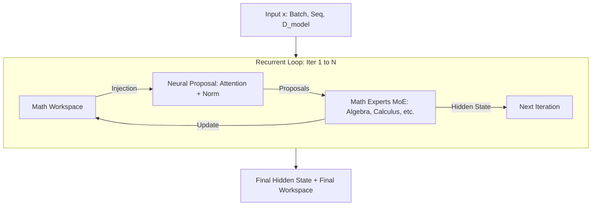
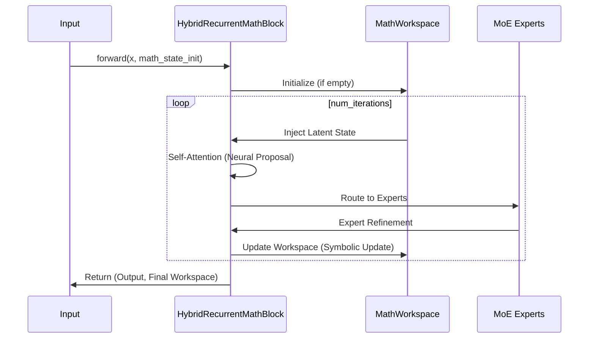

# Hybrid Neuro-Symbolic Recurrent Block

This project implements a `HybridRecurrentMathBlock` in PyTorch, designed for advanced mathematical reasoning by combining neural transformer-style processing with a persistent, differentiable mathematical workspace.

## Core Architecture

The architecture features a recurrent loop that carries both a hidden state (neural) and a mathematical workspace (symbolic/latent) across multiple iterations.

### Architecture Diagram



### Sequence Diagram



## Key Features

- **Recurrent Depth**: Shared weights across configurable iterations (default 4-8).
- **Mathematical Workspace**: Persistent state carrying latent mathematical context, numerical values, and confidence scores.
- **MoE Experts**: Specialized layers for different mathematical domains (Algebra, Calculus, etc.).
- **Differentiable Symbolic Ops**: Support for operations like symbolic-like differentiation using `torch.autograd`.
- **Stability**: Residual connections and gating mechanisms to ensure gradient flow across depth.

## Installation

```bash
pip install torch
```

## Usage

```python
import torch
from hybrid_math.block import HybridRecurrentMathBlock

# Initialize the block
block = HybridRecurrentMathBlock(d_model=512, num_iterations=6)

# Input tensor (Batch, Seq, Dim)
x = torch.randn(2, 10, 512)

# Forward pass
output_hidden, final_workspace = block(x)

print(f"Final Iteration Count: {final_workspace['iteration_count']}")
```

## Advantages and Disadvantages

### Advantages
- **Structured Reasoning**: The persistent mathematical workspace allows the model to maintain state and "reason" over multiple steps, similar to how humans use scratchpads.
- **Hybrid Flexibility**: Combines the pattern recognition strengths of Transformers with the precision of symbolic-like operations and specialized MoE experts.
- **Recurrent Efficiency**: Uses shared weights across iterations, reducing parameter count compared to deep feed-forward models while allowing for variable computation time (dynamic depth).
- **Differentiability**: The entire loop is end-to-end differentiable, enabling the use of standard gradient-based optimization even for neuro-symbolic tasks.
- **Stability**: Built-in mechanisms like residual connections, layer normalization, and LTI-style gating help mitigate vanishing/exploding gradients in the recurrent loop.

### Disadvantages
- **Computational Overhead**: Multiple iterations per block increase the training and inference time compared to a single-pass layer.
- **Memory Consumption**: Backpropagating through many recurrent iterations (BPTT) can be memory-intensive.
- **Complexity**: The architecture is more complex to implement and tune than standard Transformer blocks, requiring careful balancing between neural and symbolic components.
- **Convergence Sensitivity**: Recurrent models can be more sensitive to hyperparameter choices (like learning rate and weight initialization) to maintain stability.
- **Expert Routing**: The MoE router adds another layer of complexity, potentially leading to expert collapse if not properly regularized.

## Project Structure

- `hybrid_math/`
    - `block.py`: Main `HybridRecurrentMathBlock` implementation.
    - `workspace.py`: `MathWorkspace` class managing state.
    - `expression.py`: `MathExpression` and `SymbolicOp` utilities.
- `demo.py`: Demonstration script showing forward pass and gradient verification.
- `train_sample.py`: A basic training script template.
