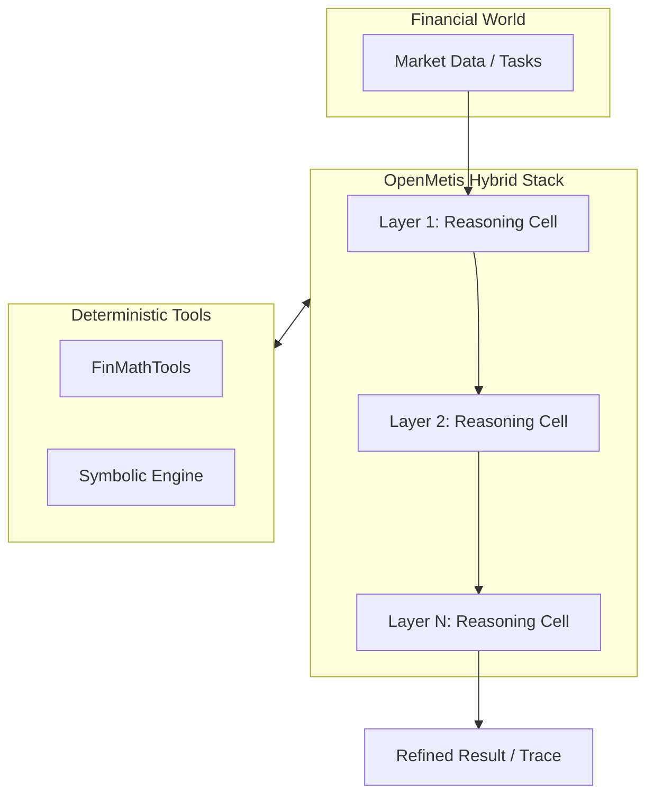
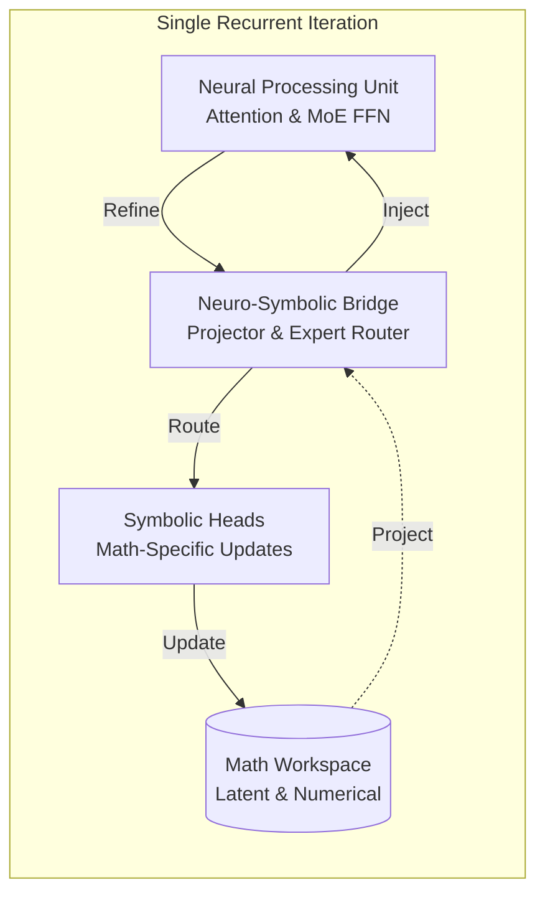
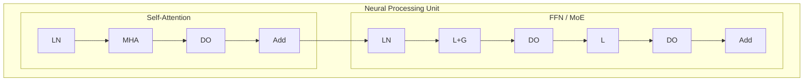
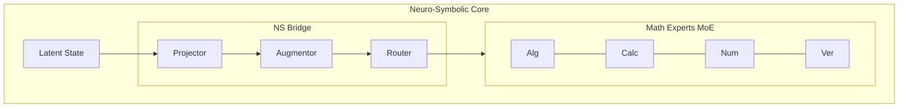
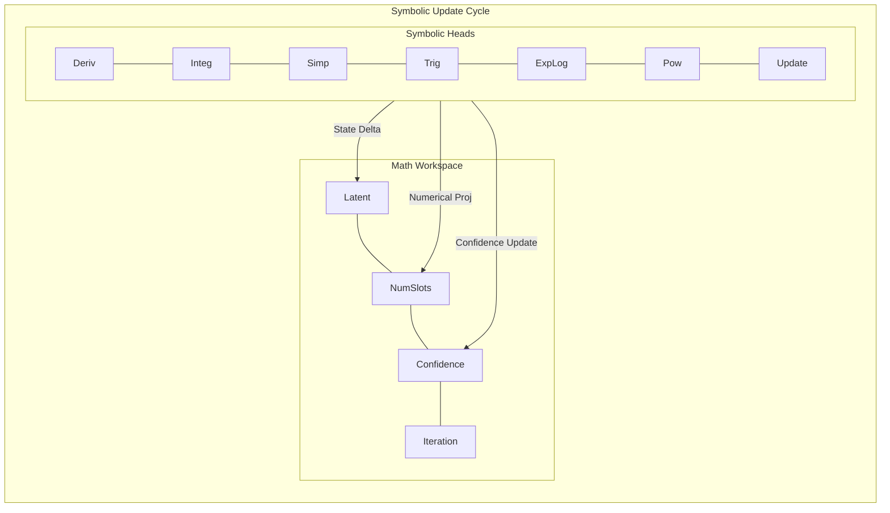
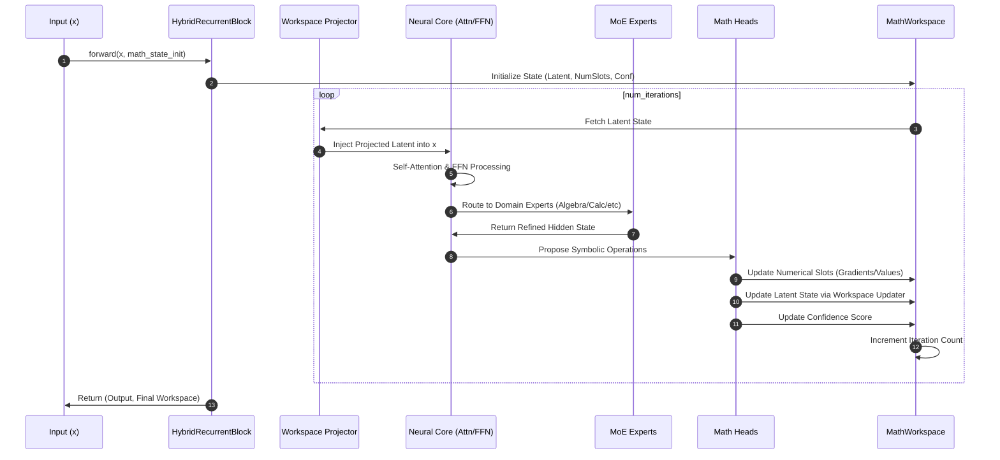

# OpenMetis: Agentic Neuro-Symbolic Workspace

OpenMetis is a state-of-the-art framework for neural-symbolic integration, designed for advanced mathematical reasoning and financial engineering. It combines neural transformer-style processing with a persistent, differentiable mathematical workspace and deterministic tool augmentation.

## Core Architecture

OpenMetis features a hierarchical architecture where multiple `NeuroSymbolicReasoningCell` layers are stacked to enable deep, multi-stage reasoning. Each layer maintains its own mathematical workspace and can delegate complex computations to specialized tools.

### Architecture Diagram

The architecture is divided into the high-level macro-flow (stacked layers) and the detailed internal recurrent processing within each cell.

#### 1. Macro-Flow (Stacked Hybrid Model)
Overview of the data flow through multiple stacked reasoning layers, interacting with the mathematical tools and the world environment.



#### 2. Recurrent Loop Detail
Internal view of the processing within the `NeuroSymbolicReasoningCell`, divided into functional stages.

##### Master Diagram: Functional Stages
High-level interaction between the neural core, symbolic bridge, and mathematical workspace within a single iteration.



##### A. Neural Processing Unit (NPU)
Handles standard transformer-style hidden state transformation.



##### B. Neuro-Symbolic Bridge & Experts
Integrates the symbolic workspace into the neural flow and routes to specialized math experts.



##### C. Symbolic Heads & Workspace Updates
Processes the refined hidden state to propose and apply updates to the persistent mathematical state.



### Sequence Diagram



## Key Features

- **Hierarchical Stacking**: Stack multiple hybrid layers (`OpenMetisHybridModel`) for deep reasoning.
- **Tool-Augmented Reasoning (Orchestrator)**: The `NeuroSymbolicReasoningCell` acts as an orchestrator, delegating complex calculations to `FinMathTools`.
- **Mathematical Workspace**: Persistent state carrying latent mathematical context, numerical values, and expression trees.
    - **Hybrid Representation**: Combines high-dimensional latent vectors with explicit **Expression Trees** for symbolic transparency.
    - **Numerical Slots**: 16 dedicated slots for storing constants, variables, and their gradients.
    - **Symbolic Expert**: Differentiable routing to algebraic rewrite rules for expression simplification.
    - **Audit Trail**: Full history of tool calls, symbolic updates, and external LLM interactions (`step_history`).
- **Recurrent Depth**: Shared weights across configurable iterations (default 4-8) per layer.
- **MoE Experts**: Specialized layers for different mathematical domains (Algebra, Calculus, etc.).
- **Differentiable Symbolic Ops**: Native support for differentiation, integration approximation, and elementary functions.

## Financial Mathematics World

OpenMetis is integrated with a specialized `world` package for financial mathematics:
- **FinancialWorld**: High-level environment for generating market data and evaluating tasks.
- **DataSources**: Synthetic generation of option pricing data (S, K, T, r, sigma).
- **Task Library**: Built-in tasks for Option Pricing, Greeks calculation, and Implied Volatility (IV) estimation.

## Agentic Workspace

This repository follows an **Agentic Workspace** workflow (see [AGENTS.md](AGENTS.md)). Specialized AI agents collaborate on the development:
- **ContextIngestor**: Maps neural-symbolic patterns.
- **CodeGenerator**: Implements neural blocks and math logic.
- **MathAgent**: Ensures numerical stability and correctness.
- **VisualizationAgent**: Provides insights into latent states and tool usage.
- **ProjectScaffolder**: Maintaining repository structure.
- **Reviewer**: Code quality and performance review.
- **TestGenerator**: Automated unit and integration testing.
- **HealthcheckAgent**: Workspace integrity.

## Installation

We recommend using [uv](https://github.com/astral-sh/uv) for fast dependency management:

```bash
uv pip install torch matplotlib pyyaml
# Or using the lockfile
uv sync
```

Alternatively, use standard pip:

```bash
pip install torch matplotlib pyyaml
```

## Usage

```python
import torch
from nn.block import NeuroSymbolicReasoningCell, MathConfig

# Initialize Configuration
config = MathConfig(
    dim=512,
    workspace_dim=128,
    max_loop_iters=6,
    n_experts=5
)

# Initialize the block
block = NeuroSymbolicReasoningCell(config=config)

# Input tensor (Batch, Seq, Dim)
x = torch.randn(2, 10, 512)

# Forward pass
output_hidden, workspace_obj, trace = block(x)
final_workspace = workspace_obj.to_dict()

print(f"Final Iteration Count: {final_workspace['iteration_count']}")
```

## Advantages and Disadvantages

### Advantages
- **Structured Reasoning**: The persistent mathematical workspace allows the model to maintain state and "reason" over multiple steps, similar to how humans use scratchpads.
- **Hybrid Flexibility**: Combines the pattern recognition strengths of Transformers with the precision of symbolic-like operations and specialized MoE experts.
- **Recurrent Efficiency**: Uses shared weights across iterations, reducing parameter count compared to deep feed-forward models while allowing for variable computation time (dynamic depth).
- **Differentiability**: The entire loop is end-to-end differentiable, enabling the use of standard gradient-based optimization even for neuro-symbolic tasks.
- **Stability**: Built-in mechanisms like residual connections, layer normalization, and LTI-style gating help mitigate vanishing/exploding gradients in the recurrent loop.

### Disadvantages
- **Computational Overhead**: Multiple iterations per block increase the training and inference time compared to a single-pass layer.
- **Memory Consumption**: Backpropagating through many recurrent iterations (BPTT) can be memory-intensive.
- **Complexity**: The architecture is more complex to implement and tune than standard Transformer blocks, requiring careful balancing between neural and symbolic components.
- **Convergence Sensitivity**: Recurrent models can be more sensitive to hyperparameter choices (like learning rate and weight initialization) to maintain stability.
- **Expert Routing**: The MoE router adds another layer of complexity, potentially leading to expert collapse if not properly regularized.

## Demos

We provide several demos to showcase the framework's capabilities:

1.  **Orchestrator Demo**: `demo_orchestrator.py` - Shows tool-augmented reasoning for Black-Scholes pricing and Greeks calculation with a full audit trail.
2.  **Visualization Demo**: `visualize_orchestrator.py` - Generates `orchestrator_trace.png` showing the consistency of tool-based reasoning.
3.  **Metis Black-Scholes Demo**: `demo_metis_bs.py` - Demonstrates autonomous model training for option pricing.
4.  **Symbolic Phase 2 Demo**: `demo_phase2.py` - Demonstrates the hybrid (tree + latent) workspace and rule-based symbolic experts.
5.  **Interactive Shell**: `interact.py` - Allows interactive exploration of the model's reasoning process and tool calls.

### Running the Orchestrator Demo

```bash
python3 demo_orchestrator.py
```

## Training and Checkpoints

We provide scripts for large-scale training using a YAML-based configuration system:

1.  `train_advanced.py`: Advanced training script with checkpointing and persistence.
2.  `metis_model/train_metis.py`: Main training script for stacked Metis models using `config.yaml`.
3.  `train_with_world.py`: Training script integrated with `FinancialWorld` for financial reasoning tasks.

### Usage: Large-Scale Training

```bash
# Train using the default config.yaml
python3 metis_model/train_metis.py

# Specify a custom config and device
python3 metis_model/train_metis.py --config config.yaml --device cpu
```

## Project Structure

- `nn/`: Core neural-symbolic components.
    - `block.py`: `NeuroSymbolicReasoningCell` implementation.
    - `workspace.py`: `MathWorkspace` managing state and history.
    - `expression.py`: `ExpressionTree` and symbolic utilities.
    - `symbolic_expert.py`: Algebraic rewrite rules and simplification.
    - `external_llm.py`: Integration with external math LLMs.
    - `fin_math.py`: `FinMathTools` for deterministic financial calculations.
    - `variants.py`: Predefined model configurations (tiny, small, medium, large).
- `metis_model/`: High-level models and training logic.
    - `model.py`: `OpenMetisHybridModel` (stacked layers).
    - `train_metis.py`: Config-driven training loop.
- `world/`: Financial mathematics environment.
    - `environment.py`: `FinancialWorld` for task management.
    - `data_source.py`: Synthetic financial data generation.
    - `tasks.py`: Financial task definitions (Pricing, Greeks, IV).
- `docs/`: Documentation and architectural insights.
- `config.yaml`: Centralized hyperparameter configuration.

## Roadmap

### Phase 1: Foundation (Completed)
- [x] Recurrent block architecture with latent workspace.
- [x] Mixture-of-Experts (MoE) routing for domain specialization.
- [x] Stacked hierarchical layers (`OpenMetisHybridModel`).
- [x] Tool-augmented reasoning (FinMath-Orchestrator).
- [x] Audit trail and reasoning traces.

### Phase 2: Enhanced Symbolic Integration (Completed)
- [x] **Tree-Based Workspace**: Transition to hybrid representation involving explicit expression trees.
- [x] **Rule-Based Proposals**: Integrate algebraic rewrite rules as a "Symbolic Expert".
- [x] **External LLM Integration**: Support for Qwen2.5-Math as specialized experts.

### Phase 3: Reasoning & Verification (In Progress)
- [ ] **Self-Correction Loop**: Retrying iterations if verification confidence is low.
- [ ] **Formal Verification**: Integration with Z3 or Lean for constraint satisfaction.
- [ ] **Reasoning Traces for LLMs**: Generating chain-of-thought data for fine-tuning.
