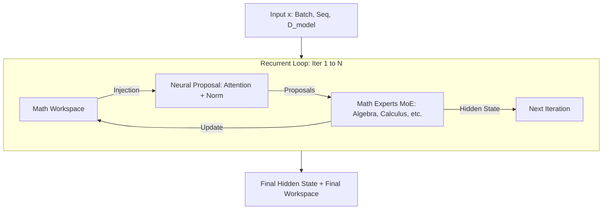
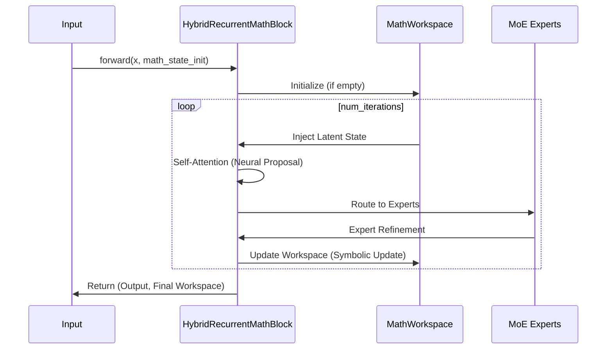

# Hybrid Neuro-Symbolic Recurrent Block

This project implements a `HybridRecurrentMathBlock` in PyTorch, designed for advanced mathematical reasoning by combining neural transformer-style processing with a persistent, differentiable mathematical workspace.

## Core Architecture

The architecture features a recurrent loop that carries both a hidden state (neural) and a mathematical workspace (symbolic/latent) across multiple iterations.

### Architecture Diagram



### Sequence Diagram



## Key Features

- **Recurrent Depth**: Shared weights across configurable iterations (default 4-8).
- **Mathematical Workspace**: Persistent state carrying latent mathematical context, numerical values, and confidence scores.
- **MoE Experts**: Specialized layers for different mathematical domains (Algebra, Calculus, etc.).
- **Differentiable Symbolic Ops**: Support for operations like symbolic-like differentiation using `torch.autograd`.
- **Stability**: Residual connections and gating mechanisms to ensure gradient flow across depth.

## Installation

```bash
pip install torch
```

## Usage

```python
import torch
from hybrid_math.block import HybridRecurrentMathBlock

# Initialize the block
block = HybridRecurrentMathBlock(d_model=512, num_iterations=6)

# Input tensor (Batch, Seq, Dim)
x = torch.randn(2, 10, 512)

# Forward pass
output_hidden, final_workspace = block(x)

print(f"Final Iteration Count: {final_workspace['iteration_count']}")
```

## Advantages and Disadvantages

### Advantages
- **Structured Reasoning**: The persistent mathematical workspace allows the model to maintain state and "reason" over multiple steps, similar to how humans use scratchpads.
- **Hybrid Flexibility**: Combines the pattern recognition strengths of Transformers with the precision of symbolic-like operations and specialized MoE experts.
- **Recurrent Efficiency**: Uses shared weights across iterations, reducing parameter count compared to deep feed-forward models while allowing for variable computation time (dynamic depth).
- **Differentiability**: The entire loop is end-to-end differentiable, enabling the use of standard gradient-based optimization even for neuro-symbolic tasks.
- **Stability**: Built-in mechanisms like residual connections, layer normalization, and LTI-style gating help mitigate vanishing/exploding gradients in the recurrent loop.

### Disadvantages
- **Computational Overhead**: Multiple iterations per block increase the training and inference time compared to a single-pass layer.
- **Memory Consumption**: Backpropagating through many recurrent iterations (BPTT) can be memory-intensive.
- **Complexity**: The architecture is more complex to implement and tune than standard Transformer blocks, requiring careful balancing between neural and symbolic components.
- **Convergence Sensitivity**: Recurrent models can be more sensitive to hyperparameter choices (like learning rate and weight initialization) to maintain stability.
- **Expert Routing**: The MoE router adds another layer of complexity, potentially leading to expert collapse if not properly regularized.

## Open-Source Math Experts

To enhance the `HybridRecurrentMathBlock`, you can integrate pre-trained mathematical models as specialized experts. Some recommended open-source models and resources include:

- **Qwen2.5-Math**: A state-of-the-art mathematical LLM series (1.5B to 72B) optimized for reasoning and problem-solving. [Hugging Face](https://huggingface.co/Qwen/Qwen2.5-Math-7B).
- **MathBERT**: A BERT-based model pre-trained on a large corpus of mathematical texts, ideal for extracting features from mathematical expressions. [Hugging Face](https://huggingface.co/tbs17/MathBERT).
- **Llama-3-Math-70B**: Various community-tuned versions of Llama-3 specifically for competitive mathematics and reasoning.
- **DeepSeek-Math**: A specialized model for mathematical reasoning that achieves high performance on benchmarks like GSM8K and MATH.

These can be integrated by replacing the default `MathExpert` with a wrapper around these pre-trained models.

## Training and Checkpoints

We provide two scripts for training and experimentation:

1.  `train_sample.py`: A basic template for a training loop.
2.  `train_advanced.py`: An advanced training script with support for:
    - **Checkpointing**: Saves and loads weights, optimizer states, and epoch metadata.
    - **Resuming**: Continue training from a previous checkpoint using the `--resume` flag.
    - **Inference**: Demonstrates how to load a model for inference after training.

### Usage: Advanced Training

```bash
# Start a new training session
python3 train_advanced.py --epochs 10 --lr 1e-4

# Resume training from a checkpoint
python3 train_advanced.py --epochs 20 --resume --checkpoint math_block_checkpoint.pth
```

## Roadmap

The development of the `HybridRecurrentMathBlock` is planned across several phases to evolve from a latent-state recycler to a full-fledged neuro-symbolic engine.

### Phase 1: Foundation (Current)
- [x] Recurrent block architecture with latent workspace.
- [x] Mixture-of-Experts (MoE) routing for domain specialization.
- [x] Basic differentiable symbolic operations (differentiation).
- [x] Advanced training script with checkpointing and persistence.

### Phase 2: Enhanced Symbolic Integration
- [ ] **Tree-Based Workspace**: Transition from purely latent vectors to a hybrid representation involving explicit expression trees.
- [ ] **Rule-Based Proposals**: Integrate a library of fixed algebraic rewrite rules (simplification, expansion) as a "Symbolic Expert".
- [ ] **Dynamic Expert Scaling**: Support for plugging in external LLMs (e.g., Qwen2.5-Math) as specialized experts via API or local weights.

### Phase 3: Reasoning & Verification
- [ ] **Self-Correction Loop**: Implement a verification-driven update where the model retries iterations if the "Verification Expert" reports low confidence.
- [ ] **Formal Verification**: Integrate with formal solvers like Z3 or Lean for hard constraint satisfaction within the loop.
- [ ] **Curriculum Learning**: Training pipeline for gradually increasing mathematical complexity (from arithmetic to calculus).

### Phase 4: Scaling & Deployment
- [ ] **Flash-Recurrence**: Optimize the recurrent loop for faster inference and reduced memory footprint during training.
- [ ] **Multi-Block Stacking**: Research on stacking multiple `HybridRecurrentMathBlocks` with hierarchical workspaces.
- [ ] **Interpretable Reasoning Traces**: Tools to visualize and export the symbolic "scratchpad" evolution in human-readable LaTeX.

## Project Structure

- `hybrid_math/`
    - `block.py`: Main `HybridRecurrentMathBlock` implementation.
    - `workspace.py`: `MathWorkspace` class managing state.
    - `expression.py`: `MathExpression` and `SymbolicOp` utilities.
- `demo.py`: Demonstration script showing forward pass and gradient verification.
- `train_sample.py`: A basic training script template.
- `train_advanced.py`: Advanced training script with checkpointing and resuming capabilities.
