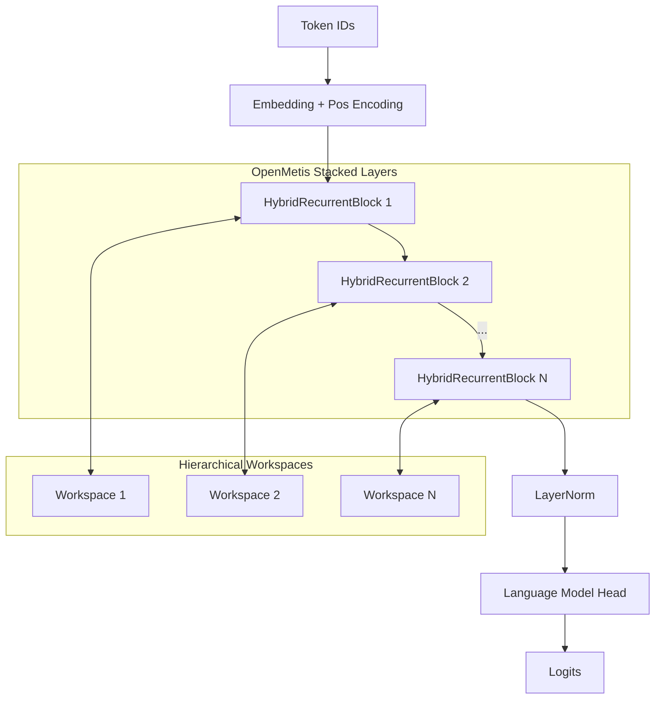
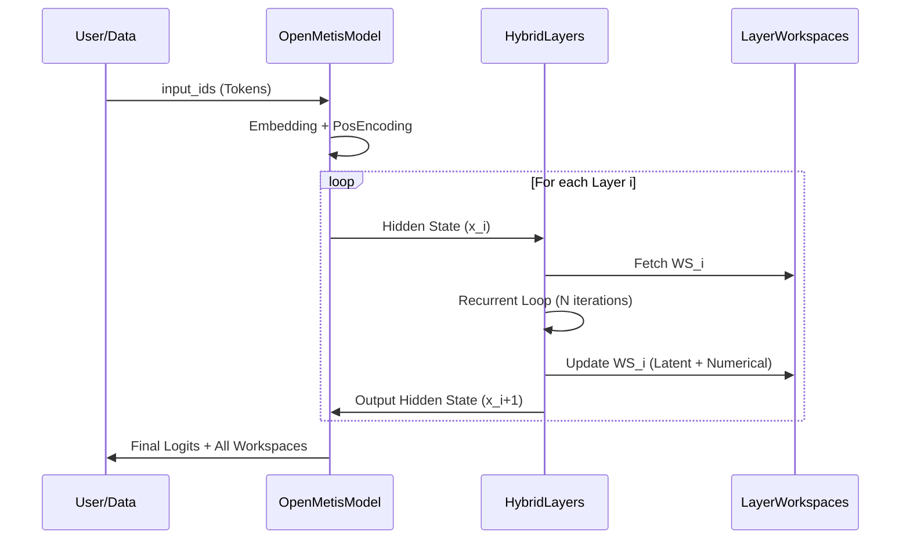

# OpenMetis Hybrid Architecture

OpenMetis is a deep neuro-symbolic model built upon the `NeuroSymbolicReasoningCell`. It stacks multiple recurrent layers, each maintaining its own mathematical workspace, to solve complex, multi-step symbolic reasoning tasks.

## Architecture Overview

The model follows a hierarchical structure where each layer processes the sequence and updates a layer-specific `MathWorkspace`. This allows the model to maintain different levels of abstraction (e.g., Layer 1 focuses on algebra, Layer 2 on calculus).

### High-Level Diagram



### Sequence Flow



## Key Components

- **Hierarchical Reasoning**: By stacking layers, the model can decompose a problem into sub-tasks, with each layer's workspace acting as a specialized "scratchpad".
- **Dynamic Iterations**: The number of recurrent iterations can be adjusted globally or per-layer at inference time to handle problems of varying complexity.
- **Symbolic Regularization**: The training script includes penalties for unstable workspace latent states, ensuring the neuro-symbolic loop converges.

## Setup and Training

### Installation
Ensure you have the core `hybrid_math` package available in your python path.

```bash
# From the project root
export PYTHONPATH=$PYTHONPATH:$(pwd)
```

### Training
The training environment supports standard language modeling objectives augmented with workspace-aware losses.

```bash
python3 metis_model/train_metis.py --epochs 10 --num_layers 4 --d_model 512
```

## Recommended Experts
For high-performance mathematical reasoning, we recommend integrating the following open-source experts into the `MathExpert` slots:
- **Qwen2.5-Math-7B**: State-of-the-art for reasoning steps.
- **DeepSeek-Math-Base**: Excellent for symbolic manipulation.
- **Llama-3-Math-Intermediate**: Good for general mathematical context.

## Data Sources
For effective training of the OpenMythos architecture, utilize:
- **GSM8K**: Grade school math word problems.
- **MATH Dataset**: Advanced high school math.
- **AMPS (Algebraic Manipulation, Proofs, and Symbols)**: Large-scale dataset for symbolic reasoning.
